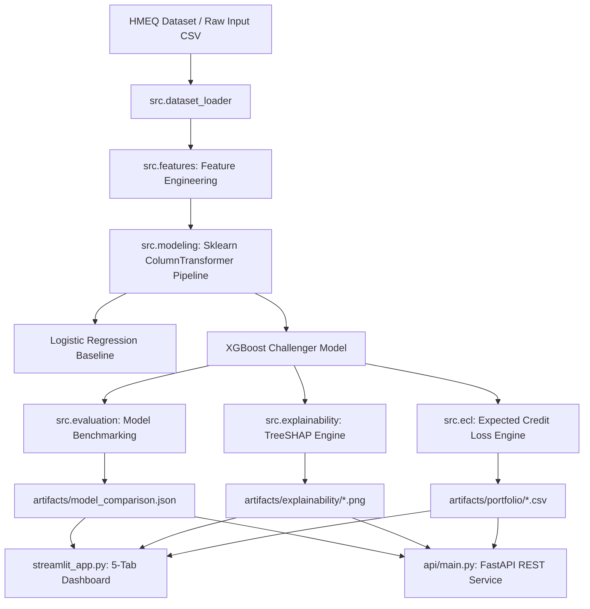

# CreditRisk AI — Credit Default Prediction & Portfolio Risk Analytics

[](https://www.python.org/downloads/release/python-3110/)
[](LICENSE)
[](https://fastapi.tiangolo.com)
[](https://streamlit.io)
[](https://xgboost.readthedocs.io)

An end-to-end Machine Learning, Financial Risk Analytics, and Portfolio Management System designed for credit default prediction, TreeSHAP explainability, and Expected Credit Loss (ECL) portfolio risk modeling.

---

## 📌 Business Problem

In retail banking and consumer lending, evaluating borrower default risk is fundamental to capital allocation, regulatory compliance, and risk-adjusted pricing. A missed default (False Negative) leads to direct principal write-offs, while a false rejection (False Positive) results in lost interest income and reduced customer acquisition.

**CreditRisk AI** provides a transparent, data-driven framework that transforms raw loan application data into actionable credit risk intelligence:
1. **Predictive Modeling:** Estimating individual Probability of Default ($PD$).
2. **Model Explainability:** Decomposing black-box predictions using TreeSHAP for regulatory compliance and adverse action notices.
3. **Expected Credit Loss (ECL):** Estimating portfolio financial exposure ($\text{ECL} = \text{PD} \times \text{LGD} \times \text{EAD}$).
4. **Interactive Underwriting:** Enabling risk officers to simulate LGD scenarios, adjust decision thresholds, and score new credit applications in real time.

---

## ✨ Key Features

- **Real Credit Data Foundation:** Built on the standard HMEQ (Home Equity Loan) dataset ($N = 5,960$).
- **Leak-Free Preprocessing:** Rigorous pipeline encapsulation preventing intra-dataset leakage (`NON_FEATURE_COLUMNS` guard).
- **Model Benchmark & Comparison:** Interpretable **Logistic Regression** baseline vs. high-capacity **XGBoost** challenger.
- **Advanced Evaluation Metrics:** ROC-AUC, Precision-Recall, Kolmogorov-Smirnov (KS) statistic, 5-fold Stratified CV, threshold sensitivity analysis, and probability calibration.
- **Explainable AI (XAI):** TreeSHAP global feature attribution, summary beeswarm plots, and individual loan risk driver/mitigant breakdowns.
- **Expected Credit Loss (ECL) Engine:** Portfolio-level risk segmentation, exposure concentration analysis (by Job and Purpose), and dynamic LGD scenario modeling.
- **Interactive Streamlit Dashboard:** 5-tab executive presentation interface with responsive Plotly visualizations.
- **Production REST API:** High-throughput FastAPI endpoints with Pydantic validation, OpenAPI documentation, and optional `X-API-Key` security.
- **Dockerization & CI/CD:** Multi-stage Docker build, `docker-compose` orchestration, and GitHub Actions CI workflow.

---

## 🏗️ Architecture



---

## 📊 Dataset Overview

The project utilizes the **HMEQ (Home Equity Loan)** dataset containing baseline and performance information for 5,960 home equity loan applicants:

- **Total Records:** 5,960 applicants
- **Target Variable (`BAD`):** Binary outcome (`BAD = 1`: Defaulted loan; `BAD = 0`: Non-bad / repaid loan)
- **Historical Default Rate:** 19.95% ($1,189$ defaults vs $4,771$ non-bad)
- **Attributes (12 Raw Variables):**
  - `LOAN`: Requested loan amount ($)
  - `MORTDUE`: Amount due on existing mortgage ($)
  - `VALUE`: Value of current property ($)
  - `REASON`: DebtCon (Debt Consolidation) or HomeImp (Home Improvement)
  - `JOB`: Occupational category (6 categories)
  - `YOJ`: Years at present job
  - `DEROG`: Number of major derogatory reports
  - `DELINQ`: Number of delinquent credit lines
  - `CLAGE`: Age of oldest credit line in months
  - `NINQ`: Number of recent credit inquiries
  - `CLNO`: Number of total credit lines
  - `DEBTINC`: Debt-to-income ratio (%)

---

## 🛠️ Feature Engineering

`src/features.py` derives 7 domain-specific financial ratio and indicator features with safe division guards (`np.errstate` handling zero denominators, missing values, and infinite propagation):

1. `LOAN_TO_VALUE`: `LOAN / VALUE` (Loan leverage ratio)
2. `MORT_TO_VALUE`: `MORTDUE / VALUE` (Senior mortgage leverage)
3. `TOTAL_DEBT_VALUE`: `(LOAN + MORTDUE) / VALUE` (Total encumbrance ratio)
4. `HAS_DEROG`: Binary indicator (`DEROG > 0`)
5. `HAS_DELINQ`: Binary indicator (`DELINQ > 0`)
6. `DELINQ_SEVERITY`: `DELINQ / CLNO` (Delinquency density per credit line)
7. `CLAGE_YEARS`: `CLAGE / 12` (Credit history age in years)

---

## 🏆 Model Performance Benchmark

Models were evaluated on a single, shared holdout test set ($20\%$, $N=1,192$, stratified by target label):

| Metric | Logistic Regression (Baseline) | XGBoost (Selected Model) | Improvement ($\Delta$) |
|---|---|---|---|
| **ROC-AUC** | `0.7704` | **`0.9516`** | $+0.1812$ |
| **5-Fold CV Mean AUC** | `0.8139 ± 0.0120` | **`0.9575 ± 0.0063`** | $+0.1436$ |
| **KS Statistic** | `0.4299` | **`0.8101`** | $+0.3802$ |
| **Accuracy (0.50)** | `0.7643` | **`0.9060`** | $+0.1417$ |
| **Precision (0.50)** | `0.4370` | **`0.8424`** | $+0.4054$ |
| **Recall (0.50)** | `0.6261` | **`0.6513`** | $+0.0252$ |
| **F1-Score (0.50)** | `0.5147` | **`0.7346`** | $+0.2199$ |
| **Average Precision** | `0.5401` | **`0.8791`** | $+0.3390$ |

**Model Selection Decision:** **XGBoost** was selected as the primary production model due to its massive predictive advantage (+0.1812 ROC-AUC) and near-doubling of the Kolmogorov-Smirnov rank-ordering statistic ($0.8101$ vs $0.4299$).

---

## 🔍 Model Explainability & SHAP

To meet banking compliance and explainability standards, `src/explainability.py` provides TreeSHAP feature attributions:

- **Top Global Risk Drivers:** `debtinc` (Debt-to-income ratio) is the single most important predictor (mean $|\text{SHAP}| = 1.439$), followed by `delinq_severity` ($0.370$), `delinq` ($0.344$), and `mort_to_value` ($0.312$).
- **Mathematical Reconstruction Guarantee:** TreeSHAP values satisfy additive feature attribution:
  $$\text{base\_value} + \sum_{j=1}^{P} \text{SHAP}_{ij} = \text{margin}_i \quad \text{and} \quad \sigma(\text{margin}_i) = P(\text{default}_i)$$
- **Individual Loan Breakdown:** Single loan applications are decomposed into Top Positive Risk Drivers ($+$) and Top Negative Risk Mitigators ($-$) with human-readable descriptions.

---

## 🛡️ Expected Credit Loss (ECL) Analytics

`src/ecl.py` implements the standard credit risk framework:

$$\text{ECL} = \text{PD} \times \text{LGD} \times \text{EAD}$$

- **PD (Probability of Default):** Model-predicted default probability ($default\_probability$).
- **LGD (Loss Given Default):** Configurable parameter with default **$0.45$ ($45\%$)** (illustrative assumption).
- **EAD (Exposure at Default):** Loan request amount ($LOAN$) as a simplified proxy.

### Portfolio Risk Highlights ($N = 5,960$)
- **Total Portfolio Exposure (EAD):** **$\$110,903,500.00$**
- **Total Expected Credit Loss (ECL):** **$\$8,800,134.31$** (Loss Rate: `7.93%`)
- **Weighted Average PD:** `17.63%`
- **High Risk Exposure Concentration:** Loans with $PD \ge 25\%$ represent $19.4\%$ of exposure but account for **$86.56\%$ of total portfolio Expected Credit Loss**.

> *Disclaimer: LGD=0.45 is an illustrative assumption and LOAN is a simplified EAD proxy. This module is an analytical demonstration and is not intended for regulatory IFRS 9 or Basel III capital compliance.*

---

## 🖥️ Streamlit Dashboard Architecture

The dashboard (`streamlit_app.py`) provides 5 dedicated tabs:

1. **Tab 1: Portfolio Overview:** Executive KPI summary, Risk segment distribution bar charts, Exposure & ECL distribution, and Top 20 Riskiest Loans table.
2. **Tab 2: Model Performance:** Logistic Regression vs XGBoost benchmark table, interactive Plotly ROC & PR curves, 5-fold CV results, and interactive threshold sensitivity slider.
3. **Tab 3: Explainability:** Global SHAP importance, XGBoost gain importance, SHAP beeswarm summary plot, and interactive applicant SHAP risk breakdown.
4. **Tab 4: Expected Credit Loss:** Interactive LGD slider ($0.10 - 0.90$) with dynamic portfolio ECL recalculations, segment breakdowns, and concentration tables by `JOB` and `REASON`.
5. **Tab 5: Loan Risk Scoring:** Interactive underwriting application form for all 12 HMEQ attributes, yielding instant PD prediction, Risk Segment badge, ECL calculation, and SHAP risk drivers.

---

## 🔌 FastAPI REST API

`api/main.py` exposes high-performance REST endpoints with Pydantic validation:

### Endpoints
- `GET /health` — Public health check & artifact status.
- `GET /model-info` — Returns active model metrics, ROC-AUC, KS statistic, and feature list.
- `POST /score` — Score single or batch loan applications. Returns default probability, risk segment, EAD, LGD, ECL, and underwriting decision.
- `POST /portfolio-summary` — Scores uploaded portfolio records and returns executive KPIs and risk segment distribution.

### Example Request (`POST /score`)
```json
{
  "records": [
    {
      "loan": 15000.0,
      "mortdue": 50000.0,
      "value": 85000.0,
      "reason": "DebtCon",
      "job": "Office",
      "yoj": 6.0,
      "derog": 0.0,
      "delinq": 0.0,
      "clage": 180.0,
      "ninq": 1.0,
      "clno": 20.0,
      "debtinc": 32.0,
      "lgd": 0.45
    }
  ],
  "threshold": 0.50
}
```

### API Key Authentication
Pass header `X-API-Key: your_secure_api_key_here` when `CREDITRISK_API_KEY` is configured in environment.

---

## 💻 Local Installation & Setup

```bash
# 1. Clone repository
git clone https://github.com/your-username/CreditRisk-AI.git
cd CreditRisk-AI

# 2. Create virtual environment
python -m venv .venv
# On Windows: .venv\Scripts\Activate.ps1
# On Linux/macOS: source .venv/bin/activate

# 3. Install dependencies
pip install -r requirements.txt

# 4. Download HMEQ dataset (if missing)
python -c "from src.dataset_loader import load_hmeq; load_hmeq('data/raw/hmeq.csv')"

# 5. Run Streamlit Dashboard
streamlit run streamlit_app.py

# 6. Run FastAPI Server
uvicorn api.main:app --host 0.0.0.0 --port 8000 --reload
```

---

## 🐳 Docker Deployment

```bash
# Build and launch both Dashboard (8501) and API (8000) using Docker Compose
docker compose up --build
```

Access Dashboard at `http://localhost:8501` and API docs at `http://localhost:8000/docs`.

---

## 📁 Project Structure

```
banking-risk-loan-default-prediction/
├── .github/workflows/ci.yml       # GitHub Actions CI workflow
├── api/
│   └── main.py                    # FastAPI REST API implementation
├── artifacts/
│   ├── explainability/            # Generated SHAP charts & JSON summaries
│   ├── portfolio/                 # Scored portfolio CSVs & KPI summaries
│   ├── metadata.json              # Active model metadata
│   ├── model.joblib               # Trained XGBoost pipeline
│   ├── model_comparison.json      # LR vs XGBoost evaluation benchmark
│   └── roc_pr_curves.png          # Evaluation curve plot
├── data/raw/hmeq.csv              # HMEQ dataset
├── render.yaml                    # Render deployment blueprint
├── scripts/
│   ├── compare_models.py          # Phase 2 model comparison script
│   ├── run_portfolio_analysis.py  # Phase 4 ECL analysis script
│   ├── train_model.py             # Model training script
│   ├── verify_phase3.py           # Phase 3 verification suite
│   ├── verify_phase4.py           # Phase 4 verification suite
│   ├── verify_phase5.py           # Phase 5 verification suite
│   └── verify_phase6.py           # Phase 6 verification suite
├── src/
│   ├── data.py                    # Portfolio frame prep & non-feature guards
│   ├── dataset_loader.py          # HMEQ loader & quality validation
│   ├── ecl.py                     # Expected Credit Loss engine
│   ├── evaluation.py              # Metrics, KS, CV, & curve generation
│   ├── explainability.py          # TreeSHAP & LR interpretability module
│   ├── features.py                # Safe feature engineering module
│   ├── modeling.py                # Sklearn pipeline builder & trainer
│   └── scoring.py                 # Portfolio scoring & risk segmentation
├── .dockerignore
├── .env.example                   # Environment configuration template
├── Dockerfile                     # Multi-stage Python 3.11 Dockerfile
├── docker-compose.yml             # Service orchestration (Streamlit + FastAPI)
├── requirements.txt               # Dependencies
├── streamlit_app.py               # 5-Tab Streamlit Dashboard
└── README.md
```

---

## ⚠️ Honest Limitations

1. **Dataset Scale & Recency:** HMEQ contains 5,960 historical records from a single mortgage portfolio.
2. **Simplified LGD & EAD:** Loss Given Default ($0.45$) is an assumed constant, and $LOAN$ is a static proxy for EAD.
3. **Absence of Macroeconomic Variables:** Does not incorporate external macroeconomic parameters (unemployment rate, interest rate shifts).
4. **No Temporal Split:** Data is split randomly (stratified) rather than using an out-of-time (OOT) historical validation window.
5. **Raw Probability Uncalibrated:** Model probabilities are uncalibrated raw tree outputs; regulatory deployment requires Platt or Isotonic probability calibration.

---

## 🔮 Future Improvements

- **Probability Calibration:** Implement Isotonic Regression & Platt Scaling for regulatory-grade PD calibration.
- **Hyperparameter Optimization:** Integrate Optuna for automated tuning of XGBoost hyperparameters.
- **Out-of-Time (OOT) Validation:** Test performance decay across temporal lending cohorts.
- **Macroeconomic Stress Testing:** Simulate ECL sensitivity under recessionary interest rate and unemployment shocks.
- **Drift Monitoring & Model Registry:** Integrate MLflow and Evidently AI for feature drift and model performance monitoring in production.

---

## 📜 License

Distributed under the MIT License.
